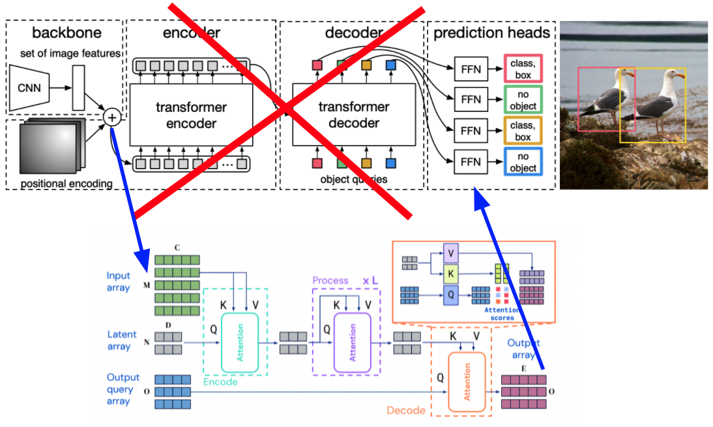

# DePerceiver: Improving Small Object Detection in DETR

This is the PyTorch Lightning code for DePerceiver. DePerceiver is a model that performs object detection by modifying the implementation of [DETR](https://github.com/facebookresearch/detr) and esceptio's implementation for [Perceiver IO](https://github.com/esceptico/perceiver-io). Although DETR performs on par with state of the art object detection models like Faster R-CNN, it lags behind in small object detection. This is due to the downsampling in the backbone; when its image features are fed into the transformers, it is difficult to use the low resolution features to detect small objects. DETR uses a transformer, whose self-attention module is quadratic with respect to image size, which does not allow it to use features at multiple scales.

We propose DePerceiver, which makes use of the Perceiver IO architecture in place of the transformer. Perceiver IO is a transformer-like architecture that has linear complexity, which allows the model to run more efficiently and to use larger feature maps (or multi-scale).



This code is our attempt to improve on object detection baselines with the DePerceiver model. The COCO 2017 dataset needs to be downloaded to train and evaluate the models in this repository. Once that is complete, the model can be trained with `main_naive.py`. The implementation details of the architecture are present under the `deperceiver/` folder.

For a more detailed description of the project see our paper here: [Paper](paper.pdf)

This code was submitted as a final project by Edward Li and Aditya Kannan for Visual Learning and Recognition (16-824) in Fall 2021.

# Dataset

Download and extract COCO 2017 train and val images with annotations from [http://cocodataset.org](http://cocodataset.org). We expect the directory structure to be the following:

```
path/to/coco/
  annotations/  # annotation json files
  train2017/    # train images
  val2017/      # val images
```

# Usage

First, clone the repository:

```git clone https://github.com/mooey5775/DePerceiver.git```

Then install PyTorch and other necessary libraries in a conda environment on Python 3.8

```
conda install -c pytorch pytorch torchvision
conda install cython scipy tqdm
pip install -U 'git+https://github.com/cocodataset/cocoapi.git#subdirectory=PythonAPI'
conda install -c conda-forge wandb pytorch-lightning
pip install einops
```

# Training

By default, wandb logging is enabled. You can pass `--no-wandb` to disable it. In your command line, run `wandb login` to set up wandb before training.

Then we can train the default DePerceiver implementation with 32x downsampling in the backbone. We suggest running with more than 1 GPU to make training run quicker. Below we use 4 GPUs.

```
python -m torch.distributed.run --nproc_per_node=4 main_naive.py --gpus 4 --coco_path /path/to/coco --lr_drop 33 --epochs 50 --num_workers 3 --run_name default_run --output_dir /path/to/checkpoint/directory --amp --no_aux_loss
```

We can change the downsampling factor to be 4, 8, or 16:

```
python -m torch.distributed.run --nproc_per_node=4 main_naive.py --gpus 4 --coco_path /path/to/coco --lr_drop 33 --epochs 50 --num_workers 3 --run_name naive_16_run --output_dir /path/to/checkpoint/directory --amp --no_aux_loss --downsample_factor 16
```

We also attempted a multi-scale implementation, which can be trained as follows. It does not perform very well and likely needs more tuning.

```
python -m torch.distributed.run --nproc_per_node=4 main_naive.py --gpus 4 --coco_path /path/to/coco --lr_drop 33 --epochs 50 --num_workers 3 --run_name naive_multiscale_run --output_dir /path/to/checkpoint/directory --amp --no_aux_loss --multiscale
```

Using this, we can train and evaluate our model. You can use wandb to visualize the model performance.

# License

DePerceiver is released under the Apache 2.0 license. Please see the [LICENSE](LICENSE) file for more information.
